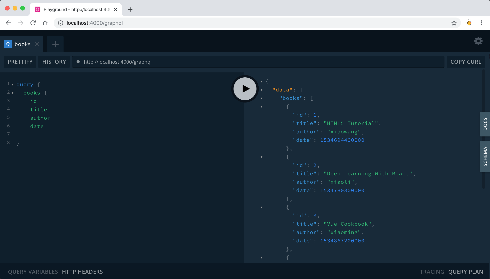
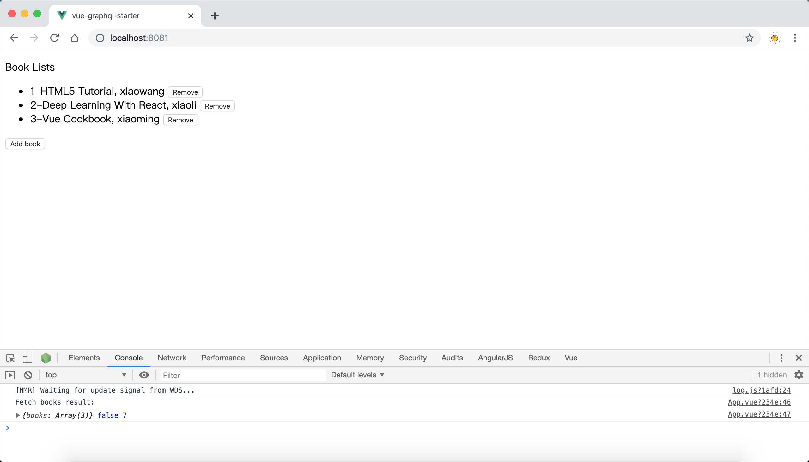

# vue-graphql-starter

Create a Vue and koa project with GraphQL.

## Project Structure

```
├── LICENSE
├── README.md
├── babel.config.js
├── package-lock.json
├── package.json
├── public
│   └── index.html
├── server.js
└── src
    ├── App.vue
    └── main.js
```

## Create Vue Project

Use [Vue CLI](https://cli.vuejs.org/) to create a Vue project, as how to create a Vue project is not the point, we can skip to next section.

## Create Apollo Server

Now we use koa to create a GraphQL server, based on Apollo Server.

Install dependencies

```
npm i koa koa-static apollo-server-koa graphql --save
```

Create a file named `server.js`

```js
const Koa = require('koa');
const { ApolloServer, gql } = require('apollo-server-koa');

// Mock Data
const BOOKS = [
  {
    id: 1,
    title: 'HTML5 Tutorial',
    author: 'xiaowang',
  },
  {
    id: 2,
    title: 'Deep Learning With React',
    author: 'xiaoli',
  },
];

// Data Schema
const typeDefs = gql`
  type Book {
    id: Int!
    title: String
    author: String
  }
  type Query {
    books: [Book]
    book(id: Int!): Book
  }
`;

// Resolvers
const resolvers = {
  Query: {
    // query all
    books() {
      return BOOKS;
    },
    // query one by id
    book(root, args) {
      return BOOKS.filter(book => book.id === args.id)[0];
    },
  },
};

const server = new ApolloServer({ typeDefs, resolvers });

const app = new Koa();
server.applyMiddleware({ app });

const PORT = process.env.PROT || 4000;
app.listen(PORT, () => console.log(`App running in http://localhost:${PORT}`));
```

Start the server then visit `http://localhost:4000/graphql`, we can see a graphql ui playground like this:



## Create A Apollo Client In Vue

Install dependencies

```
npm i vue-apollo graphql apollo-boost --save
```

Instance a Apollo Client, and create a apolloProvider by VueApollo, then inject apolloProvider to Vue

```js
import Vue from 'vue';
import App from './App.vue';

import ApolloClient from 'apollo-boost';
import VueApollo from 'vue-apollo';

const apolloClient = new ApolloClient({
  uri: 'http://localhost:4000/graphql',
});

Vue.use(VueApollo);

const apolloProvider = new VueApollo({
  defaultClient: apolloClient,
});

Vue.config.productionTip = false;

new Vue({
  el: '#app',
  apolloProvider,
  render: h => h(App),
});
```

## Usage in Vue components

In a Component, we can use `this.$apollo` to query or mutate

```js
import { gql } from 'apollo-boost';

const FETCH_BOOKS = gql`
  query {
    books {
      id
      title
      author
      date
    }
  }
`;

export default {
  // ...
  methods: {
    fetchBooks() {
      this.$apollo.addSmartQuery('books', {
        query: FETCH_BOOKS,
        result: ({ data, loading, networkStatus }) => {
          console.log('Fetch books result:');
          console.log(data, loading, networkStatus);
        },
        error(error) {
          console.log(`Some error happened: ${error.toString()}`);
        },
      });
    },

    async addBook() {
      const ret = await this.$apollo.mutate({
        mutation: gql`
          mutation($title: String!, $author: String!) {
            addBook(title: $title, author: $author) {
              id
              title
              author
              date
            }
          }
        `,
        variables: {
          title: 'New Book',
          author: 'TOM',
        },
        refetchQueries: [
          {
            query: FETCH_BOOKS,
          },
        ],
      });

      // TODO error handlder
      console.log('Add book success:');
      console.log(ret);
    },
    // ...
  },
  // ...
};
```

As for data display:

```html
<template>
  <div id="app">
    <p>Book Lists</p>
    <template v-if="books.length > 0">
      <ul>
        <li v-for="item in books" :key="item.id">
          {{ `${item.id}-${item.title}` }}, {{ item.author }}
          <button @click="removeBook(item.id)">Remove</button>
        </li>
      </ul>
      <button @click="addBook">Add book</button>
    </template>
    <template v-else>loading...</template>
  </div>
</template>
```

At last start our project to preview:



We can click _Add book_ button to add items or click _Remove_ button to remove a book.

[source code](https://github.com/wangchi/vue-graphql-starter)

## Related reference

- [Vue CLI](https://cli.vuejs.org/)
- [Vue Apollo](https://apollo.vuejs.org/)
- [Integrating with Node.js middleware](https://www.apollographql.com/docs/apollo-server/integrations/middleware/)

## License

[MIT LICENSE](./LICENSE)
